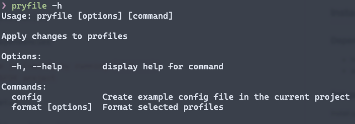

# pryfile.js

## Installation

### Dependencies

-   Node.js (verify by running `node -v`)
-   an SFDX project

### Setup

Install pryfile with npm

```bash
  npm i -g pryfile
```

Verify install

```bash
  pryfile -h
```



Due to a bug using prettier plugins as a dependency, you'll have to install it in your SFDX project for now.

**Run this from inside your SFDX project directory!!**

```bash
  npm i @prettier/plugin-xml
```

## Usage

pryfile is to be used from within an SFDX project directory. It's easiest to open a project in VS Code, then open the embedded terminal (`ctr`/`cmd`+`j`).

-   Create an example configuration file

```bash
  pryfile config
```

> This will create a file named `.pryfilerc` in the root directory of your project. It will include all of the profiles found in the project, as well as example formatting.

-   add fields to be added/overwritten to `.pryfilerc`
-   list only the profiles you want modified
-   run pryfile

```bash
  pryfile
```

### Options

-   `pryfile format` - formats the specified profiles without adding anything new
-   `pryfile format -a` - format _all_ profiles in the project
